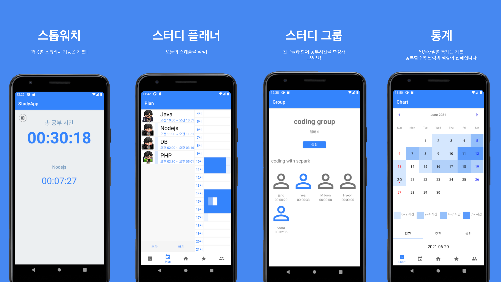

# Study App (열품타 클론코딩)

> 열품타 어플을 클론코딩한 팀 프로젝트

저희 조는 공부에대한 자극이나 동기부여를 받을 수 있는 수단을 고민했습니다.
대면하지 않고서도 함께 목표를 정해 달성할수 있는 무언가가 있으면 좋지 않을까?
조사를 하던 중 저희와 같은 생각을 한 사람들이 줌 독서실을 열거나 오픈 채팅을 열어,
사람들과 소통하며 동기부여를 주고받고 있다는 사실을 알게 되었습니다.

# 대상 선정

> 저희는 다음과 같은 사람들을 대상으로 프로젝트를 진행하기로 하였습니다.

- 집에서 집중하기 어려운 사람
- 스터디를 통해 소통하고 싶은 사람
- 스케줄 관리를 하고 싶은 사람
- 동기부여가 필요한 사람

# 주요 기능

## 타이머

> 과목 생성, 과목별 공부 타이머

## 캘린더

> 공부 기록, 통계

## 플래너

> 공부 계획 추가 제거

## 랭킹

> 공부 랭킹 일/주/월

## 그룹

> 그룹 소개, 그룹 방, 그룹 채팅
